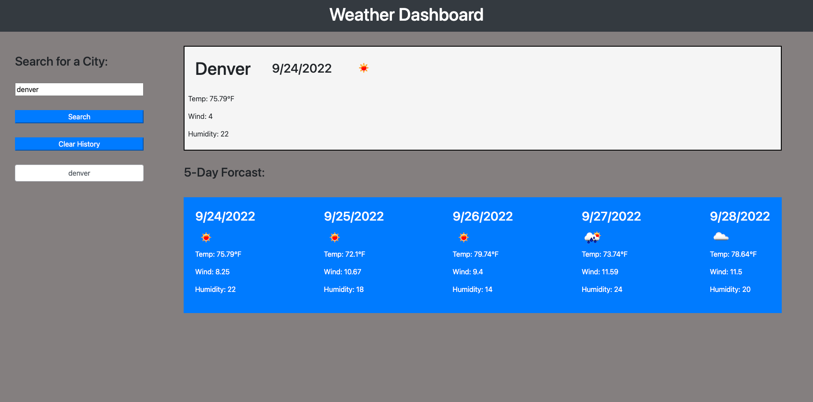

# weather-dashboard
## Description
For module 6's challenge we were asked to create a weather app displaying the current weather of a searched city, as well as the 5 day forcast of that city. This challenge we were asked to use the Open Weather Map api. For this chalenege we used HTML, CSS, JavScript, bootstrap, and 3rd party API's. During this challenge I struggled a bit with getting the api all set up correctly. I did a lot of DOM manipulation with the forcast and appending it to the page / creating the elements within JavaScript. This challenge really made me go over JavaScript and DOM manipulation. It helped me solidify my knowedge in those areas. I also feel a but more comfortable with event listeners, and when they are neeeded. 

[deployed site](https://mmockus15.github.io/weather-dashboard/)

Accetance Criteria:

GIVEN a weather dashboard with form inputs
WHEN I search for a city
THEN I am presented with current and future conditions for that city and that city is added to the search history
WHEN I view current weather conditions for that city
THEN I am presented with the city name, the date, an icon representation of weather conditions, the temperature, the humidity, and the wind speed
WHEN I view future weather conditions for that city
THEN I am presented with a 5-day forecast that displays the date, an icon representation of weather conditions, the temperature, the wind speed, and the humidity
WHEN I click on a city in the search history
THEN I am again presented with current and future conditions for that city